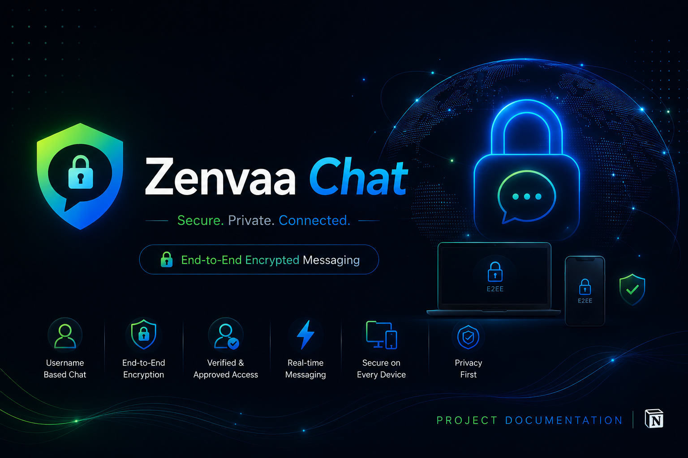
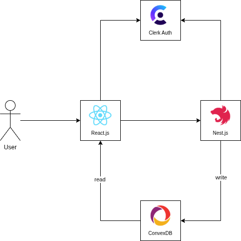

# Zenvaa Chat 🔐

Zenvaa Chat is a modern, end-to-end encrypted (E2EE) web-based messaging platform, built as a personal learning and portfolio project. It explores secure communication design, modern web development practices, and scalable system architecture.

Messages are encrypted and decrypted entirely on the client device — the server never has access to plaintext message content, private keys, or shared secrets.

> 📄 **A detailed case study covering the design decisions, encryption flow, and architecture reasoning behind this project is available on Notion:** [https://agrawalyash.notion.site/Zenvaa-Chat-Case-Study-3a35c8bb362a809cbec4d91556020819?pvs=74]

---

## Table of Contents

- [About](#about)
- [Key Features](#key-features)
- [Tech Stack](#tech-stack)
- [System Architecture](#system-architecture)
- [Encryption Flow (E2EE)](#encryption-flow-e2ee)
- [Project Scope](#project-scope)
- [Status](#status)

---

## About

Zenvaa Chat enables users to communicate securely using unique usernames, while ensuring message contents remain private through end-to-end encryption. Unlike public messaging platforms, Zenvaa Chat follows an **approval-based registration model** — users can register and request access, but accounts are activated only after administrator approval. This is intentional, since the app is meant to be demonstrated to recruiters, friends, family, and selected testers rather than being publicly available.

### Project Objectives

- Build a secure end-to-end encrypted messaging application.
- Learn modern authentication and authorization techniques.
- Implement secure key management and encrypted message exchange.
- Explore real-time communication.
- Practice scalable backend architecture and database design.
- Demonstrate secure software engineering practices suitable for production-inspired systems.

---

## Key Features

- End-to-end encrypted one-to-one messaging
- Username-based user discovery
- Email and Google OAuth authentication (via Clerk)
- Approval-based account activation
- Secure password hashing
- Session and device management
- Real-time message delivery
- User blocking and reporting
- Modern, responsive user interface
- Privacy-focused architecture with encrypted message storage

---

## Tech Stack

| Layer | Technology |
|---|---|
| Frontend | React.js |
| Backend | NestJS |
| Authentication | Clerk (Email + Google OAuth) |
| Database & Realtime | ConvexDB |
| Encryption | WebCrypto API (ECDH key exchange + AES-GCM) |

---

## System Architecture

- **Writes** (e.g. sending a message) flow through `React.js → NestJS → ConvexDB`, so NestJS can authenticate and validate the request before anything is persisted.
- **Realtime reads** flow directly `ConvexDB → React.js` via Convex's reactive subscriptions — this delivers new messages instantly without any manual WebSocket handling.
- **Clerk** issues and manages the user's session on the frontend; **NestJS** verifies that session/token before trusting any write request.
- Convex query functions independently check the requesting user's identity before returning any data — so direct client reads remain access-controlled, not open.

---

## Encryption Flow (E2EE)

1. **Key generation** — Each user's public/private key pair is generated locally on their device using WebCrypto. The private key never leaves the device; only the public key is sent to the backend and stored.
2. **Key exchange** — When User A wants to chat with User B, the server returns User B's public key to User A.
3. **Shared secret** — Both users independently compute the same shared secret using their own private key and the other person's public key (ECDH). This secret is never transmitted over the network.
4. **Encryption** — The message is encrypted on the sender's device using the shared secret (AES-GCM) before it ever leaves the device.
5. **Storage & relay** — The server (NestJS + ConvexDB) only ever stores and forwards ciphertext — never plaintext, private keys, or the shared secret.
6. **Realtime delivery** — ConvexDB pushes the new ciphertext directly to the recipient's client in real time.
7. **Decryption** — The recipient independently computes the same shared secret on their device and decrypts the message locally.

**Core guarantee:** the server only ever handles public keys and ciphertext — never plaintext or private keys.

---

## Project Scope

Zenvaa Chat is intended solely as an educational and portfolio project. It is not designed to operate as a public messaging platform or commercial communication service. The focus is on demonstrating secure system design, authentication, encryption, and full-stack development skills, while maintaining responsible security practices.